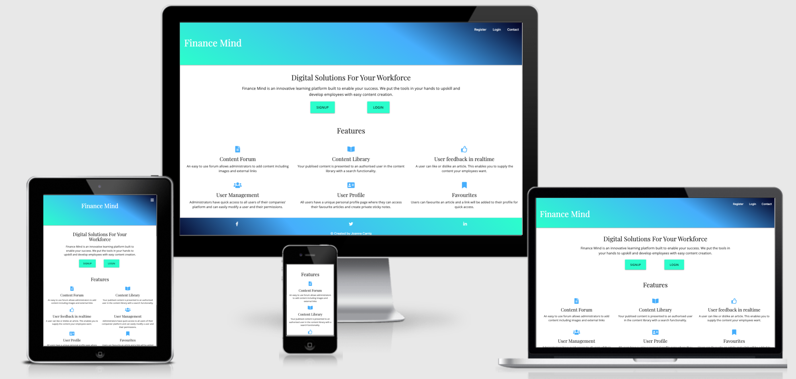
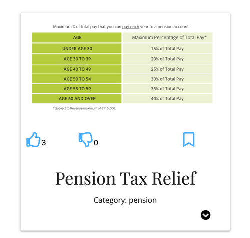
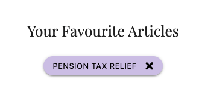
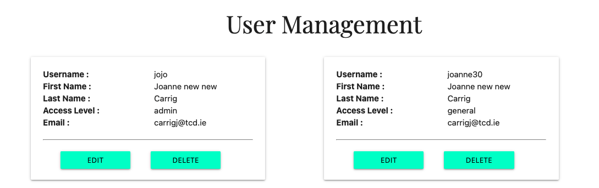

# Finance Mind Learning Application

## Introduction
The Finance Mind application is a platform that allows a company to provide learning content to its staff in an easy to use format. The idea was developed based on my own want for such an application in my current job that would also ensure data security. 

View Live Website [here](https://learning-platform-ms3.herokuapp.com/)

Image created using [Am I responsive](http://ami.responsivedesign.is/)

## Table of Contents

- [UX](#ux)
  - [Strategy](#strategy)
    - [User Needs](#user-needs)
        - [As a site user](as-a-site-user)
        - [As the business owner](as-the-business-owner)
  - [Scope](#scope)
    - [Features](#features)
    - [Future Features](#future-features)
  - [Structure](#structure)
  - [Skeleton](#skeleton)
  - [Surface](#surface)
    - [Colour Scheme](#colour-scheme)
    - [Typography](#typography)
- [Testing](#testing)
    - [Development Issues](#development-issues)
    - [Code Validation](#code-validation)
        - [Html](#html)
        - [CSS](#css)
        - [Javascript](#javascript)
    - [Performance Testing](#performance-testing)
    - [User Stories Testing](#user-stories-testing)
    - [Functionality Testing](#functionality-testing)
    - [Validation Testing](#validation-testing)
    - [Compatibility Testing](#compatibility-testing)
        - [Different devices](#different-devices)
        - [Different Browsers](#different-browsers)
        - [Different Operating Systems](#different-operating-systems)
- [Technologies Used](#technologies-used)
    - [Frameworks and Libraries](#frameworks-and-libraries)
    - [Version Control](#version-control)
    - [Other Programs](#other-programs)
- [Deployment](#deployment)
- [Credits](#credits)
    - [Code](#code)
    - [Content](#content)
    - [Media](#media)
    - [Acknowledgements](#acknowledgements)

## UX

The 5 planes of User Experience:

### Strategy
Finance Mind was created with the purpose of providing an innovative solution to allow a company's trainning team provide relevant and informative finance content to their employees in a secure platform, to assist with self learning. 

#### User Needs

##### As a site user
- I want to be able to understand the site purpose immediately.
- I want to be able to register and login, so that I can access the learning content.
- I want to be able to easily naviage the site, ensuring I can acess the desired content with ease. 
- I want to be able to search articles to show relevant results only.
- I want to be able to favourite articles for quick access in the future.
- I want to be able to contact the site admin if needed.
- I want to be able to update my own user details, such as password without needing to contact the site admin.
- I want to be able to create short personal notes, that only I have access to.

##### As a site admin
- I want to be able to create site content such as articles that allow the inclusion of resources such as images and links. 
- I want to be able to edit all site library contents, even if another admin created it. 
- I want to be able to amend all users' details, to enable a change in user access rights or if user has issue logging in. 
- I want to be able to remove a user from the platform and all their stored data.
- I want to be informaed of users reaction to content. 

##### As the business owner
- I want to enable my employees to learn on the go.
- I want my employees to stay up to date on relevant topics.
- I want to see feedback from users engaging with content. 

### Scope

#### Features 

The following features are in scope for this project.
- Register Functionality.
  - Validated form to allow user create a profile for accessing the application. 
- Login Functionality.
  - Validated form that checks the users stored details and logs user in only if a successful match. 
- Navigation Menu.
  - A navigation menu will be presented on all pages on application. 
- Responsive Design.
  - Application is responsive on all device size and browsers.
- CRUD Functionality.
  - Application enables the functionality to Create, Read, Update and Delete data.
- Database to store app data.
  - MongoDB database will be used to store all application data. 
- Contact Form.
  - Contact form to enable user to send message to admin. 
- Library with searchable content.
  - Search bar that allows user query to filter the articles to shown those with a match only. 
- Favourite article.
  - Allow user to create a quick link on their profile that redirects to the article that was favoured.
- Article like and dislike feedback.
  - like and dislike button that records the total like and dislikes of an article.
- Profile Page.
  - Unique profile for each user that shows their favoured articles and sticky notes.
- Add sticky note on profile page.
  - Option to create a new sticky note when on profile page.
- Edit sticky note on profile page.
  - Edit selected note where data is prefilled on form.
- Admin content creation. 
  - Form to create site contents that only admin has access to. 
- Admin content edit. 
  - Edit selected article where data is prefilled on form.
- Admin user management 
  - Page that shows all registered users and allows admin user to edit or delete users.
- User settings page.
  - Page that user can amend their own profile settings. 
- 404 Error Page
  - A custom 404 error page if the user navigate to a resourse that doesnt exist with a button to return home. 

#### Future Features 

I would like to include the following future features.
- Messaging functionality for admin to users.
  - The feature when an admin user could choose a user to send a private message to.
- Push notifications about new content been added.
  - The option to send a notification to all site users when new articles added to encourage their continued learning. 

### Structure

During the planning stage, it was decided that the following pages would be needed to ensure the user needs are meet:

- Landing Page with elements:
  - To tell vistior what the application is for.
  - To allow user to register.
  - To allow user to login.
  - To allow user to contact site admin.

- Content Library with elements:
  - To allow user to search library.
  - To allow user to like and dislike article.
  - to favourite article.
  - To read content and interact with it as needed.
  - For an admin user to allow them to edit or delete content. 

- Profile Page with elements:
  - Welcome message.
  - To create a new sticky note.
  - To edit an existing note.
  - To view articles favored and ability to click and be redirected to article. 
  - Ability to remove favourites.
  - To be able to edit user profile settings.

- User Management Page with elements (only for admin user):
  - To see all registered users.
  - To edit users.
  - To delete users.

- Add site content page with elements (only for admin user):
  - Forum to fill in:
    - Category
    - Title
    - Content body
    - Keywords
    - Picture
    - External resource
  - Content body to preserve formatting as entered by user. 

### Skeleton

#### Wireframes

Wireframes for this project were created using Balsamiq and can be viewed at below link.

Link to [Wireframe](static/wireframes/wireframes.pdf)

#### Database Design

This application uses Mongo DB to store and retrieve the user data. Mongo DB is a non-relational databse. This application consists of 4 collections as shown in the schema diagram below. 

The users collection is populated when a user succesfully registers and is used to verify a user upon login.The content collect stores the data for articles that appear on the library page. Only an admin user can add to this collection. The posts collection stores the data for a users stick notes that are displayed on their profile. The favourites collection takes record of a users favoured articles. 

### Surface

The Finance Mind application was designed to reinforce learning and create a sense of trust among learners using soft tones. 

#### Colour Scheme

Shades of blue were used to create the impression of trust and loyalty. Turquoise was used to represent open communication, creativity and calming nature. The combination of shades between blue and green are widely used in financial websites. A ligther shade creates the association while also looking modern. 

The colours used are shown below:

The navbar is a gradient of these colors to give a fresh appearance by mergining the colors. 

#### Typography

Fonts used are Playfair Display for Headings and Open sans for paragraph elements. These fonts look professional while maintaining readability. 

## Testing

A summary of testing conducted is shown in the table below. 

### Code Validation

#### Html

Html pages were validated with [W3C Html Checker](https://validator.w3.org/nu/). To obtain the HTML code on live pages, the safari developer tools were used to open the page source html and this was copied and pasted into the text input field on W3C for validation.

The pages validated are shown below.

A warning appeared on all pages that the flash message section lacked a heading. This warning can be ignored as the section contains a heading element where the elements html is injected with jinga templating language when needed. Any pages where an error was found are detailed below.

##### Landing Page 

The only error present was that their was an unmatched trailing div. This was removed and the code rechecked. 

#### Home

On first check, there was 3 errors. The first error was that the image elements were missing an alt attribute. I added this in. The second error is that the article icons all had the same ID. I replaced this with class as each article would have 3 occurances of this value and this violates the definition of a unique ID. The last error is that their was an unclosed div element. I located the element and corrected this. 

#### Content

Two errors were present. The first was that the attribute pattern is not allowed on a textarea element. I removed this attribute and have custom javascript to validate this field when white space is present only. The second error is that there was a stray div present. I checked the file and removed this. 

All pages now sucessfully pass through the validator as shown in the image below.

#### CSS

CSS page was validated with [W3C CSS Validator](https://jigsaw.w3.org/css-validator/)

No errors were present.

#### Javascript

Javascript files were validated with [JSHint](https://jshint.com/)

Missing semi-colons were added and the scripts retested. No errors or warnings present.

#### Python

Python files were validated with [PEP8 online](http://pep8online.com)

The error present was that the app.py file had several occurances where a line was greater than 79 characters. I reformatted the app.py file to ensure no line was more than 79 characters and retested.

The file is now PEP8 compliant.

### Performance Testing

Performance was tested using Lighthouse, one of Google's web developer tools.
To improve the SEO of the app, I added a meta description. Additonally I added the attribute rel="noopener" to all 'a' elements to increase the app security.

For the Library Page (home), the best practices score was 87% due to images been displayed with the incorrect aspect ration. I changed the css to preserve the aspect ratio of the images. This resulted in the best practives score increasing to 100% and improved the layout for user experience. 

example output from ligthhouse audit for page home

The final results for each page are shown in the below table.

### User Stories Testing

The user's needs are met as follows:

#### Site user

> I want to be able to understand the site purpose immediately.

The Landing Page describes the purpose of Finance Mind clearly. Some of the features are highligthed to give a user a flavour of what is possible on the platform. Two call to action buttons show the user they can signup or login. Additonally the navbar, again reinforces the option to register or login.

> I want to be able to register and login, so that I can access the learning content.

An easy to understand form is provided to create an account. If an entered value does not match what is required, the user is presented with an error message to help them complete registration. 

A registered user can login to their profile by providing the registered username and password. This data is securly saved in the MongoDB database and upon login request the entered values are checked. If they match the database data, the user is logged in, if incorrect the user is given a warning message. If user is still having difficult they can contact the site admin, who will be able to reset their password.

> I want to be able to easily naviage the site, ensuring I can acess the desired content with ease. 

Upon login, a user is automatically redirected to the libray page where all the articles are present. All pages contain a navbar with navigation links that will redirect a user to their desired location. If a user tries to naviate to a resource that doesnt exist. A custom 404 page will be displayed with a button to return to home page. 

> I want to be able to search articles to show relevant results only.

A search bar is present on the Library page that allows a user to enter a query that will filter the articles to show any matching results. If no result is found, the user is advised. Additionally, a user is given a reset button to clear the search bar, returning the page to show all.

> I want to be able to favourite articles for quick access in the future.

Each article has a favoruite icon (the widely associated bookmark icon). When a user clicks this, they get a message to say that the article was favoured and a quick link added to their profile.

> I want to be able to contact the site admin if needed.

The site admin can be contacted by filling out a form on the contact page. Upon submission the user is advised that the message was sent and admin will contact them shortly. 

> I want to be able to update my own user details, such as password without needing to contact the site admin.

On the users profile page there is an icon of a user with settings wheel. If user hovers over this it informs them to edit their user profile. When clicked a form is prefilled with the user details and they can edit the available fields and click update. The users details in the database will be updated accordingly. The user gets a message once updated. 

> I want to be able to create short personal notes, that only I have access to.

The users profile page has a section called your notes. A plus icon advises the user they can add a new note. Once clicked a form is presented to the user and once submitted a new note is added to the users profile in date order.

##### Site admin

> I want to be able to create site content such as articles that allow the inclusion of resources such as images and links. 

An admin user is presented with additonal navigation options. One is to add site content. When clicked this will load a form that allows an admin user to create a new article for the site library. The form allows optional images and external resouce links as further reading.

> I want to be able to edit all site library contents, even if another admin created it. 

An admin user is presented with an edit and delete button on all articles on the library page. A general user does not have this functionality. These buttons enable to ability for admin to edit the article on a prefilled form or delete the article with a confirm message. 

> I want to be able to amend all users' details, to enable a change in user access rights or if user has issue logging in. 

User Management page presents all register users on the app in alphabetical order. An admin user can choose to amend a user by clicking the edit button on that user. This functionality is only accessible to an authorised admin user.

> I want to be able to remove a user from the platform and all their stored data.

An admin user can click the delete button to remove a user and this will remove all their data from the database. A confirm message is presented on all delete functionality. 

> I want to be informed of users reaction to content. 

All articles show the number of likes and dislikes. The admin team can use this information to create similar content to what has been liked the most. As per image above, the number of likes and dislikes is shown on the article. 

##### Business owner

> I want to enable my employees to learn on the go.

The application is responsive across devices and a registered user can access the app once they have internet connection. This enables on the go learning.

> I want my employees to stay up to date on relevant topics.

The ability for the admin / content moderators to edit and create new content helps ensure relevant topics are being pushed to employees. Articles are shown in date order of newest material at the top. 

> I want to see feedback from users engaging with content. 

All articles show the number of likes and dislikes. The admin team can use this information to create similar content to what has been liked the most. 

### Functionality Testing

I tested the functionality of the site on a laptop and mobile device. Each page was tested and results are given below:

| **Page**     | **Functions checked** | **Working Correctly Desktop** | **Mobile** |
| --- | --- | --- | 
| **Landing** | | | |
|           | Signup button opens registration form| ✓| ✓|  
|           | Login button opens login form| ✓| ✓|  
|           | navigation links open correct page| ✓| ✓|  
|           | Click on logo redirect to landing page| ✓| ✓|  
|           | Footer links navigate to correct page in new window| ✓| ✓|  
| **Register** | | | |
|           | If enter valid date, user created and logged in| ✓| ✓| 
|           | If enter username already in database, given error that username already exists, try another. | ✓| ✓|  
| **Login** | | | |
|           | If valid details, logged in and redirect to Library page| ✓| ✓|  
|           | If invalid details, not logged in and error message given| ✓| ✓| 
| **Contact** | | | |
|           | User not allowed to send empty form| ✓| ✓| 
|           | When submitted, user gets message to advise message sent.| ✓| ✓| 
|           | Admin recieves message that was sent.| ✓| ✓| 
| **Library** | | | |
|           | Search bar filter articles absed on query| ✓| ✓| 
|           | If not matching results, message shown to user| ✓| ✓| 
|           | Reset button cleares search| ✓| ✓| 
|           | Search button submits query for search| ✓| ✓| 
|           | Article like button increases scrore by 1 when clicked | ✓| ✓| 
|           | Article dislike button increases scrore by 1 when clicked | ✓| ✓| 
|           | Article favourite icon adds the clicked article to favs section on profile| ✓| ✓| 
|           | Article expand button expands article to view its contents| ✓| ✓| 
|           | Further Reading button opens resource in new window| ✓| ✓| 
|           | Clicking on the expand icon when expanded closes the section| ✓| ✓| 
|           | Admin - edit button on article opens prefilled content form| ✓| ✓| 
|           | Admin - delete button on article gives confirm message and if press ok, article removed from library| ✓| ✓|  
| **Profile** | | | |
|           | User settings page loads when click the icon, with the correct data shown | ✓| ✓| 
|           | Favourite article link when clicked redirects to correct article | ✓| ✓| 
|           | The plus icon under notes opens the add note form| ✓| ✓| 
|           | The edit button on note, opens prefilled note form| ✓| ✓| 
|           | The delete button gives user delete confirm message and when press ok, note deleted.| ✓| ✓| 
|           | Notes shown in date order| ✓| ✓| 
| **Logout** | | |
|           | users data is removed from session when click log out| ✓| ✓| 
| **Note** | | |
|           | Valid form creates a new note on the users profile| ✓| ✓| 
| **Edit Note** | | |
|           | The prefilled note, can be editted and once user pressed update, the note shows the new information| ✓| ✓|  
| **User Management** | | | |
|           | All registered users are shown to an admin user alphabetically based on first name| ✓| ✓| 
|           | Admin - click edit button oens form with the selected users details| ✓| ✓| 
|           | Admin - click delete button - confirm prompt and then user removed from users screen| ✓| ✓| 
| **Add Site Contents** | | | |
|           | Valid form can be submitted| ✓| ✓| 
|           | New article created on the Library page in date order of creation| ✓| ✓| 

### Validation Testing

contact form

### Compatibility Testing

#### Different devices

Using Google Developer tools, I viewed the website on the following devices:
- Galaxy S5
- Pixel 2
- Pixel 2 XL
- iPhone 5/6/7/8 & Plus
- iPhone X
- iPad & iPad Pro
- Surface duo
- Galaxy fold

#### Different Browsers

I tested the website on:

- Google Chrome
- Safari
- Firefox
- Microsoft Edge
- Internet Explorer

Differences discovered across browsers:

#### Different Operating Systems

The above testing was conducted on below operating systems:

- Windows 8.1
- MacOS Big Sur 11.2.3
- iOS 14.4.2
- Android

There were no differences detected on those operating systems. [Browser Stack](live.browserstack.com) was used to view and check the functionality across a wide range of devices and operating systems.

### Development Issues

- 

## Technologies Used

### Frameworks and Libraries

- [Google Fonts](https://fonts.google.com/) was used to import the font selectedfor the website.
- [jQuery](https://jquery.com/) was used as a Javascript library.

### Version Control

- [Git](https://git-scm.com/) was used as a version control system.
- [GitHub](https://github.com/) was used for the repository hosting.
- [Gitpod](https://www.gitpod.io/) was used as the developer platform.

### Other Programs

- [Balsamiq](https://balsamiq.com/) was used to create a mock-up of the website after exploring the strategy and scope planes of user experience for this project.
- [W3C CSS Validator](https://jigsaw.w3.org/css-validator/) was used to validate CSS code.
- [W3C Html Checker](https://validator.w3.org/) was used to validate HTML code.
- [Pic Resize](https://picresize.com/) was used to resize images available on the website, improving its performance.
- [Ligthhouse](https://github.com/GoogleChrome/lighthouse) was used to audit my website. The results of the audit were considered when making improvements to the website's performance etc.
- [Am I responsive](http://ami.responsivedesign.is/) was used to view the website across several devices at once.
- [W3C Spell checker](https://www.w3.org/2002/01/spellchecker) was used to check the spelling of the website.
- [Can I use](https://caniuse.com/) was used to check browser supports range and potential compability issues and known bugs. 
- [Browser Stack](live.browserstack.com) was used to test the website on different operating systems and browsers.
- [Favicon from Pics](http://favicon.htmlkit.com/favicon/) was used to create a favicon to be used in the address bar.

## Deployment

## Credits

### Code

### Content

### Media

### Acknowledgements
